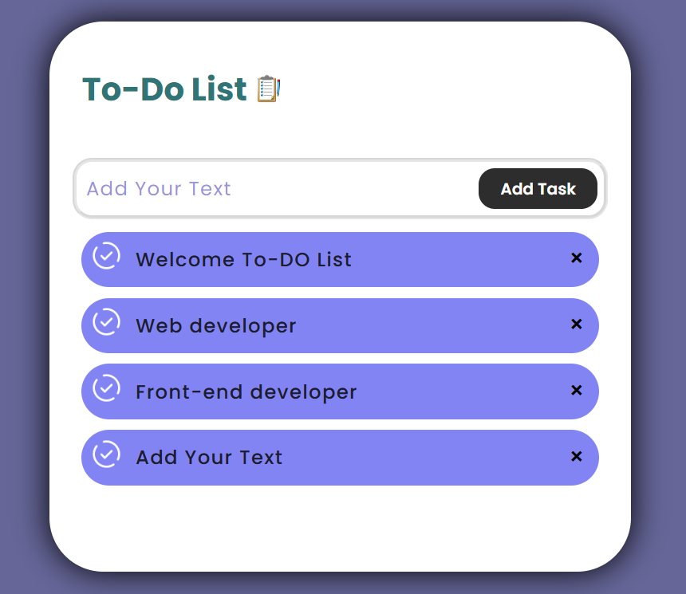

# To-Do List 📝

A clean, minimal, and responsive **To-Do List** web application built using **HTML, CSS, and JavaScript**. This project allows you to add and delete tasks with ease and is perfect for beginners who are learning DOM manipulation and UI design.




---

## 🚀 Features

- ✅ Add your own tasks dynamically
- ❌ Delete tasks with a single click
- 🎨 Stylish and responsive UI
- 💾 LocalStorage integration (Optional - to be added)
- 📱 Mobile-friendly design
- 💡 Great project to practice core JavaScript and DOM handling

---

## 🎨 Design

The UI includes:
- A curved box layout with shadow and gradient background
- Sleek button styles and font animations
- Task cards with icons and rounded corners
- Modern and calming purple color scheme

> Designed for simplicity, usability, and visual appeal.  
> Based on this layout:

🔗 Live Demo

👉 View Live Project
    Go to:https://peaceful-elf-38cfd1.netlify.app

## 📂 Technologies Used

- HTML5
- CSS3 (with transitions and gradients)
- JavaScript (ES6+)

---

## 🧑‍💻 How to Run Locally

Follow these simple steps:

```
# 1. Clone the repository
git clone https://github.com/rohitmahato/to-do-list.git

# 2. Navigate into the folder
cd to-do-list

# 3. Open index.html in your browser

📂 Folder Structure:

to-do-list/
│
├── public/
│   └── index.html
│
├── src/
│   ├── assets/
│   │   └── logo.png (optional)
│   ├── components/
│   │   └── TodoItem.jsx
│   │   └── TodoList.jsx
│   ├── App.jsx
│   ├── index.js
│   └── styles.css
│
├── .gitignore
├── package.json
├── README.md
└── screenshot.png
```
---
<!-- index.html (Home Page) -->
<!DOCTYPE html>
<html lang="en">
<head>
  <meta charset="UTF-8">
  <meta name="viewport" content="width=device-width, initial-scale=1.0">
  <title>FashionHub - Home</title>
  <link rel="stylesheet" href="style.css">
</head>
<body>
  <!-- Navbar -->
  <header>
    <nav class="navbar">
      <div class="logo">FashionHub</div>
      <ul class="nav-links">
        <li><a href="index.html">Home</a></li>
        <li><a href="products.html">Products</a></li>
        <li><a href="about.html">About</a></li>
        <li><a href="contact.html">Contact</a></li>
        <li><a href="#" class="cart">🛒</a></li>
      </ul>
    </nav>
  </header>

  <!-- Hero Section -->
  <section class="hero">
    <h1>Step Into Style</h1>
    <p>Discover the latest fashion trends for Men, Women, and Kids</p>
    <a href="products.html" class="btn">Shop Now</a>
  </section>

  <!-- Categories -->
  <section class="categories">
    <h2>Shop by Category</h2>
    <div class="category-grid">
      <div class="category-card men">Men</div>
      <div class="category-card women">Women</div>
      <div class="category-card kids">Kids</div>
    </div>
  </section>

  <!-- Featured Products -->
  <section class="products">
    <h2>Featured Collection</h2>
    <div class="product-grid">
      <div class="product-card">
        
        <h3>Classic White Shirt</h3>
        <p>$35</p>
        <a href="#" class="btn">Add to Cart</a>
      </div>
      <div class="product-card">
        
        <h3>Summer Floral Dress</h3>
        <p>$49</p>
        <a href="#" class="btn">Add to Cart</a>
      </div>
      <div class="product-card">
        
        <h3>Stylish Denim Jacket</h3>
        <p>$65</p>
        <a href="#" class="btn">Add to Cart</a>
      </div>
    </div>
  </section>

  <!-- Footer -->
  <footer>
    <p>&copy; 2025 FashionHub | Designed with ❤️</p>
  </footer>
</body>
</html>


<!-- products.html -->
<!DOCTYPE html>
<html lang="en">
<head>
  <meta charset="UTF-8">
  <meta name="viewport" content="width=device-width, initial-scale=1.0">
  <title>FashionHub - Products</title>
  <link rel="stylesheet" href="style.css">
</head>
<body>
  <header>
    <nav class="navbar">
      <div class="logo">FashionHub</div>
      <ul class="nav-links">
        <li><a href="index.html">Home</a></li>
        <li><a href="products.html" class="active">Products</a></li>
        <li><a href="about.html">About</a></li>
        <li><a href="contact.html">Contact</a></li>
        <li><a href="#" class="cart">🛒</a></li>
      </ul>
    </nav>
  </header>

  <section class="products-page">
    <h2>All Fashion Products</h2>
    <div class="product-grid">
      <div class="product-card">
        
        <h3>Casual Blue Shirt</h3>
        <p>$40</p>
        <a href="#" class="btn">Add to Cart</a>
      </div>
      <div class="product-card">
        
        <h3>Elegant Evening Dress</h3>
        <p>$70</p>
        <a href="#" class="btn">Add to Cart</a>
      </div>
      <div class="product-card">
        
        <h3>Leather Jacket</h3>
        <p>$120</p>
        <a href="#" class="btn">Add to Cart</a>
      </div>
      <div class="product-card">
        
        <h3>Kids Summer Outfit</h3>
        <p>$30</p>
        <a href="#" class="btn">Add to Cart</a>
      </div>
    </div>
  </section>

  <footer>
    <p>&copy; 2025 FashionHub | Designed with ❤️</p>
  </footer>
</body>
</html>


<!-- about.html -->
<!DOCTYPE html>
<html lang="en">
<head>
  <meta charset="UTF-8">
  <meta name="viewport" content="width=device-width, initial-scale=1.0">
  <title>FashionHub - About</title>
  <link rel="stylesheet" href="style.css">
</head>
<body>
  <header>
    <nav class="navbar">
      <div class="logo">FashionHub</div>
      <ul class="nav-links">
        <li><a href="index.html">Home</a></li>
        <li><a href="products.html">Products</a></li>
        <li><a href="about.html" class="active">About</a></li>
        <li><a href="contact.html">Contact</a></li>
        <li><a href="#" class="cart">🛒</a></li>
      </ul>
    </nav>
  </header>

  <section class="about">
    <h2>About FashionHub</h2>
    <p>FashionHub is your go-to destination for trendy clothing that combines comfort with style. Our mission is to make fashion accessible and affordable for everyone.</p>
    <p>We bring you carefully curated collections from top designers around the world, ensuring every piece you wear makes a statement.</p>
  </section>

  <footer>
    <p>&copy; 2025 FashionHub | Designed with ❤️</p>
  </footer>
</body>
</html>


<!-- contact.html -->
<!DOCTYPE html>
<html lang="en">
<head>
  <meta charset="UTF-8">
  <meta name="viewport" content="width=device-width, initial-scale=1.0">
  <title>FashionHub - Contact</title>
  <link rel="stylesheet" href="style.css">
</head>
<body>
  <header>
    <nav class="navbar">
      <div class="logo">FashionHub</div>
      <ul class="nav-links">
        <li><a href="index.html">Home</a></li>
        <li><a href="products.html">Products</a></li>
        <li><a href="about.html">About</a></li>
        <li><a href="contact.html" class="active">Contact</a></li>
        <li><a href="#" class="cart">🛒</a></li>
      </ul>
    </nav>
  </header>

  <section class="contact">
    <h2>Contact Us</h2>
    <form>
      <input type="text" placeholder="Your Name" required>
      <input type="email" placeholder="Your Email" required>
      <textarea placeholder="Your Message" required></textarea>
      <button type="submit" class="btn">Send Message</button>
    </form>
  </section>

  <footer>
    <p>&copy; 2025 FashionHub | Designed with ❤️</p>
  </footer>
</body>
</html>


/* style.css */
body {
  margin: 0;
  font-family: Arial, sans-serif;
  background: #fdfdfd;
  color: #333;
}

/* Navbar */
.navbar {
  display: flex;
  justify-content: space-between;
  align-items: center;
  padding: 15px 50px;
  background: #111;
  color: #fff;
}
.navbar .logo {
  font-size: 24px;
  font-weight: bold;
}
.navbar .nav-links {
  list-style: none;
  display: flex;
  gap: 20px;
}
.navbar .nav-links li a {
  color: #fff;
  text-decoration: none;
  transition: color 0.3s;
}
.navbar .nav-links li a:hover,
.navbar .nav-links li a.active {
  color: #ff4081;
}

/* Hero */
.hero {
  text-align: center;
  padding: 80px 20px;
  background: linear-gradient(rgba(0,0,0,0.4), rgba(0,0,0,0.4)), url('images/hero.jpg') center/cover no-repeat;
  color: #fff;
  animation: fadeIn 2s ease-in;
}
.hero h1 {
  font-size: 50px;
  margin-bottom: 10px;
}
.hero .btn {
  display: inline-block;
  margin-top: 20px;
  padding: 12px 25px;
  background: #ff4081;
  color: #fff;
  text-decoration: none;
  border-radius: 25px;
  transition: transform 0.3s;
}
.hero .btn:hover {
  transform: scale(1.1);
}

/* Categories */
.categories {
  padding: 50px;
  text-align: center;
}
.category-grid {
  display: grid;
  grid-template-columns: repeat(auto-fit, minmax(200px, 1fr));
  gap: 20px;
  margin-top: 20px;
}
.category-card {
  padding: 60px 20px;
  background: #eee;
  border-radius: 15px;
  font-size: 20px;
  font-weight: bold;
  transition: transform 0.3s, background 0.3s;
  cursor: pointer;
}
.category-card:hover {
  transform: translateY(-10px);
  background: #ff4081;
  color: #fff;
}

/* Products */
.products, .products-page {
  padding: 50px;
  text-align: center;
}
.product-grid {
  display: grid;
  grid-template-columns: repeat(auto-fit, minmax(220px, 1fr));
  gap: 25px;
  margin-top: 30px;
}
.product-card {
  background: #fff;
  border-radius: 15px;
  padding: 20px;
  box-shadow: 0 4px 10px rgba(0,0,0,0.1);
  transition: transform 0.3s;
}
.product-card:hover {
  transform: scale(1.05);
}
.product-card img {
  width: 100%;
  border-radius: 10px;
  margin-bottom: 15px;
}
.btn {
  display: inline-block;
  padding: 10px 20px;
  background: #111;
  color: #fff;
  text-decoration: none;
  border-radius: 25px;
  transition: background 0.3s;
}
.btn:hover {
  background: #ff4081;
}

/* About */
.about {
  padding: 60px;
  text-align: center;
  line-height: 1.8;
}

/* Contact */
.contact {
  padding: 60px;
  text-align: center;
}
.contact form {
  max-width: 500px;
  margin: auto;
  display: flex;
  flex-direction: column;
  gap: 15px;
}
.contact input, .contact textarea {
  padding: 12px;
  border: 1px solid #ccc;
  border-radius: 8px;
}
.contact button {
  padding: 12px;
  background: #ff4081;
  color: #fff;
  border: none;
  border-radius: 25px;
  cursor: pointer;
  transition: transform 0.3s;
}
.contact button:hover {
  transform: scale(1.05);
}

/* Footer */
footer {
  text-align: center;
  padding: 20px;
  background: #111;
  color: #fff;
  margin-top: 40px;
}

/* Animations */
@keyframes fadeIn {
  from { opacity: 0; }
  to { opacity: 1; }
}
